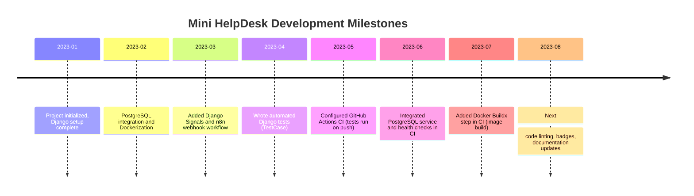

# Executive Summary  
The **Mini HelpDesk** project is a Django-based ticketing system with a PostgreSQL database, containerized via Docker and Docker Compose, and integrated with n8n for workflow automation through webhooks triggered by Django signals. A suite of automated Django model tests (using `django.test.TestCase`) has been added to verify core functionality (e.g. ticket creation and field persistence). A continuous integration pipeline is implemented with GitHub Actions: on every push or pull request, the workflow checks out the code, sets up Python 3.12, installs dependencies, runs database migrations, and executes the tests. In the same CI job, a PostgreSQL service container is started (with health checks via `pg_isready`) and environment variables (`POSTGRES_*`) are provided so Django can connect. After tests pass, the pipeline uses Docker’s Buildx and the `docker/build-push-action` to build the Docker image, ensuring the Dockerfile is valid. During development, common issues were addressed: for example, a local “no space left on device” (`ENOSPC`) error was resolved by pruning unused Docker images and containers (`docker system prune`).  

**Key files and their status** are summarized below. All core features (Django app, PostgreSQL, Docker, n8n integration, tests, CI workflow) are implemented. Remaining tasks include publishing the Docker image to a registry, adding code-quality checks (linters), and polishing the README with badges and documentation. This report outlines the architecture, testing and CI setup, troubleshooting steps, and next steps in detail.  

# Project Overview  
The Mini HelpDesk is a RESTful ticketing system built with **Django** and **PostgreSQL**. It supports creating user accounts and tickets (with fields like title, description, priority, and status). When tickets are created or updated, Django **signals** fire webhooks to an **n8n** automation workflow, enabling integration with other systems (e.g. notifications or external services). The application is fully containerized: a `Dockerfile` defines the Python environment for the Django app, and `docker-compose.yml` orchestrates the `web` (Django) and `db` (PostgreSQL) services locally. In development, one runs:  

```bash
docker compose up -d --build        # Build images and start web + db 
docker compose exec web python manage.py migrate  # Apply migrations
docker compose exec web python manage.py runserver # Run the web server
```  

This uses Docker Compose to build the Dockerfile and launch services. Docker Compose “builds your web image, pulls the [PostgreSQL] image, and starts both containers” with one command. Environment variables (from a `.env` file) configure the database connection and secret keys, avoiding hard-coded secrets. The `backend/settings.py` uses these variables, e.g.:  

```python
DATABASES = {
    "default": {
        "ENGINE": "django.db.backends.postgresql",
        "NAME": os.getenv("POSTGRES_DB"),
        "USER": os.getenv("POSTGRES_USER"),
        "PASSWORD": os.getenv("POSTGRES_PASSWORD"),
        "HOST": os.getenv("POSTGRES_HOST", "localhost"),
        "PORT": os.getenv("POSTGRES_PORT", "5432"),
    }
}
```  

No real credentials are committed; real deployments should use protected secrets or a `.env` file kept out of version control.  

# Architecture and Components  
- **Django Backend**: The core REST API and web interface (if any) are implemented in Django (likely Django REST Framework). Key app modules include ticket models, views, and serializers. Django Admin can be used for data inspection.  
- **PostgreSQL Database**: A relational database for storing Users, Tickets, and other models. Locally, a Dockerized Postgres is run via Docker Compose. In CI, a PostgreSQL service container is defined for tests.  
- **Docker & Docker Compose**: The application is containerized for consistency. The `Dockerfile` (in the repo root) starts from `python:3.12`, installs requirements, copies code, and sets the startup command. For example, a typical Dockerfile might contain:  

  ```dockerfile
  FROM python:3.12-alpine            # Build an image with Python 3.12  
  WORKDIR /app  
  COPY backend/requirements.txt .  
  RUN pip install -r requirements.txt  
  COPY backend/ .  
  CMD ["gunicorn", "config.wsgi:application"]  
  ```  

  Running `docker compose up` uses this Dockerfile to build the app image and starts the `db` container as defined in `docker-compose.yml`. Docker Compose simplifies multi-container management (services/networks) in one YAML file.  
- **n8n Automation**: n8n is a workflow automation tool (open-source) used to define automated flows. Django signals (in the app code) trigger POST webhooks to n8n when events occur (e.g. ticket creation), allowing email notifications or other integrations. (Exact n8n flow definitions are outside the code repo, but their invocation is via HTTP calls.)  
- **Webhooks & Signals**: Django’s signal framework is used so that when the `Ticket` model is saved, a signal handler sends a webhook to the n8n endpoint. This decouples event triggering from processing.  
- **CI/CD (GitHub Actions)**: A workflow (`.github/workflows/ci.yml`) automates testing and builds on each push/PR. Its steps (detailed below) cover code checkout, Python setup, dependency installation, migrations, testing, and Docker image build.  

# Testing Strategy  
Automated tests are implemented using Django’s `TestCase`. For example, in `tickets/tests.py` a test class `TicketModelTest(TestCase)` was added:  

```python
from django.test import TestCase
from django.contrib.auth.models import User
from .models import Ticket

class TicketModelTest(TestCase):
    def test_create_ticket(self):
        user = User.objects.create_user(username="zahra", password="1234")
        ticket = Ticket.objects.create(
            title="Cannot login",
            description="Forgot password",
            priority="HIGH",
            status="OPEN",
            user=user,
        )
        self.assertEqual(ticket.title, "Cannot login")
        self.assertEqual(ticket.priority, "HIGH")
        self.assertEqual(ticket.user.username, "zahra")
```

This test verifies that a `Ticket` can be created and its fields (title, priority, user) are saved correctly. Importantly, Django’s `TestCase` runs each test in a transaction that is **rolled back at the end**, ensuring a clean database for each test. (In effect, a separate test database is created and destroyed automatically, so the real data is untouched.) Running tests locally is done via Docker:  
```bash
docker compose exec web python manage.py test
```  
This output shows something like:  
```
Creating test database...
.
----------------------------------------------------------------------
Ran 1 test in 0.4s

OK
Destroying test database...
```
Passing tests indicates the core ticket creation feature works, and sets the stage for CI integration.

# CI/CD Pipeline (GitHub Actions)  
The GitHub Actions workflow (`ci.yml`) is triggered on every push or pull request to the `main` (or `master`) branch. The job runs on an Ubuntu VM and performs these steps:

- **Checkout Code**: `actions/checkout@v4` retrieves the repository code.  
- **Setup Python**: `actions/setup-python@v5` installs Python 3.12.  
- **Install Dependencies**: Runs `pip install -r backend/requirements.txt`.  
- **PostgreSQL Service**: Under `services:`, a `postgres:16` container is started with environment variables:
  ```yaml
  services:
    postgres:
      image: postgres:16
      env:
        POSTGRES_DB: minihelpdesk
        POSTGRES_USER: postgres
        POSTGRES_PASSWORD: postgres
      ports:
        - "5432:5432"
      options: >-
        --health-cmd="pg_isready -U postgres"
        --health-interval=10s
        --health-timeout=5s
        --health-retries=5
  ```
  This ensures the database is ready before tests run. The `--health-cmd pg_isready` makes the runner wait until Postgres accepts connections.  
- **Set Environment Vars**: The same `POSTGRES_*` variables are also exported to the job (with `POSTGRES_HOST: localhost`) so Django can connect to the service. (In GitHub Actions, when using services on the runner VM, the host is `localhost`, not the container name.)  
- **Database Migrations**: Within the `backend` directory, `python manage.py migrate` is run to apply migrations to the test database.  
- **Run Tests**: `python manage.py test` executes all Django tests. If any test fails, the workflow stops with an error. Using a dedicated Postgres service in CI mirrors production more closely than SQLite tests alone (see GitHub’s docs on service containers).  
- **Build Docker Image**: After tests pass, Docker Buildx is set up and the image is built:
  ```yaml
  - name: Set up Docker Buildx
    uses: docker/setup-buildx-action@v3
  - name: Build Docker image
    uses: docker/build-push-action@v6
    with:
      context: .
      push: false
      tags: mini-helpdesk:latest
  ```
  This uses the official Docker Buildx action to build the image from the repo’s `Dockerfile` without pushing it to a registry. This step verifies that the Dockerfile and app code produce a valid image. If the build fails, the CI job fails.

The combined workflow (included below) ensures continuous integration: every code change is automatically tested against a real PostgreSQL environment, and the container image is validated. 

```yaml
name: Django CI

on:
  push:
    branches: [main, master]
  pull_request:
    branches: [main, master]

jobs:
  test:
    runs-on: ubuntu-latest

    services:
      postgres:
        image: postgres:16
        env:
          POSTGRES_DB: minihelpdesk
          POSTGRES_USER: postgres
          POSTGRES_PASSWORD: postgres
        ports:
          - "5432:5432"
        options: >-
          --health-cmd="pg_isready -U postgres"
          --health-interval=10s
          --health-timeout=5s
          --health-retries=5

    env:
      POSTGRES_DB: minihelpdesk
      POSTGRES_USER: postgres
      POSTGRES_PASSWORD: postgres
      POSTGRES_HOST: localhost
      POSTGRES_PORT: 5432

    steps:
      - uses: actions/checkout@v4
      - uses: actions/setup-python@v5
        with:
          python-version: 3.12
      - name: Install dependencies
        run: |
          python -m pip install --upgrade pip
          pip install -r backend/requirements.txt
      - name: Migrate database
        working-directory: backend
        run: python manage.py migrate
      - name: Run tests
        working-directory: backend
        run: python manage.py test
      - name: Set up Docker Buildx
        uses: docker/setup-buildx-action@v3
      - name: Build Docker image
        uses: docker/build-push-action@v6
        with:
          context: .
          push: false
          tags: mini-helpdesk:latest
```

This workflow is based on recommended patterns from GitHub’s documentation, which shows how to define service containers and health checks.  

# Docker Build in CI  
Using Docker Buildx in CI ensures that the Dockerfile remains valid and that the application can be containerized. After tests, `docker/setup-buildx-action` creates a modern builder, and `docker/build-push-action` builds the image. These steps mimic running `docker build .` locally but in an isolated CI environment. In future, one could extend this to push the image to a Docker registry (e.g. Docker Hub or GitHub Container Registry) by adding `push: true` and registry credentials via `docker/login-action`. For now, the action tags the image as `mini-helpdesk:latest` without pushing. This ensures that every merge produces a verified build artifact.

# Troubleshooting (Disk Space)  
During development, a “no space left on device” (`ENOSPC`) error was encountered (when VS Code or Docker tried to write files). Investigation revealed the main partition was ~90% full, largely due to accumulated Docker images and containers. To diagnose, the commands `df -h` and `docker system df` were used to check disk usage. The `docker system df` report showed ~2 GB of images. Unused Docker resources were removed by running:  

```bash
docker builder prune -f   # Clean up build cache
docker system prune -a -f --volumes
```  

These commands free space by removing stopped containers, unused networks, dangling images, and volumes. After pruning, the CI and code editor operations proceeded without errors. In summary, freeing Docker cache is a standard solution for local `ENOSPC` issues.

# Key Files and Paths  

| File/Path                            | Purpose                                               | Status      |
|--------------------------------------|-------------------------------------------------------|-------------|
| `Dockerfile`                         | Defines Docker image for Django app (Python setup)    | Done        |
| `docker-compose.yml`                 | Defines local dev services (web and db)               | Done        |
| `backend/settings.py` (DATABASES)    | Django DB config using `POSTGRES_*` env vars          | Done        |
| `backend/requirements.txt`           | Python dependencies for Django                       | Done        |
| `backend/manage.py`                  | Django CLI commands (migrate, runserver, test)       | Done        |
| `tickets/tests.py` (or `backend/tests.py`) | Django model tests (e.g. TicketModelTest)           | Done        |
| `.github/workflows/ci.yml`           | GitHub Actions workflow (CI pipeline)               | Done        |
| `README.md`                          | Project documentation (this file)                   | In progress |
| `n8n/` (workflow definitions)        | n8n automation flows (external, triggered by webhooks)| Done (external) |
| Lint/config files (e.g. `.flake8`, `.github/workflows/lint.yml`) | Code quality checks (not yet added)       | To do       |

*Status:* All core infrastructure is implemented. Next steps (marked “To do”) include code quality actions and polishing documentation.

# Reproducing and Usage  
To run locally:  
1. **Build and start services** (in project root):  
   ```bash
   docker compose up -d --build
   ```  
   This builds the Django image and starts the `web` and `db` containers (the Postgres service).  
2. **Apply migrations**:  
   ```bash
   docker compose exec web python manage.py migrate
   ```  
3. **Create a superuser or runserver**:  
   ```bash
   docker compose exec web python manage.py createsuperuser
   docker compose exec web python manage.py runserver
   ```  
4. **Run tests** (locally):  
   ```bash
   docker compose exec web python manage.py test
   ```  

To trigger CI:  
- Make code changes, then commit and push to GitHub:  
  ```bash
  git add .
  git commit -m "Your message"
  git push origin main
  ```  
- On GitHub, the Actions tab will show the pipeline run. If tests fail or Dockerfile has errors, the CI job will fail, preventing merges until fixed. Successful CI indicates the code is healthy.  

# Security and Credentials  
No sensitive credentials are stored in the repo. The Django `SECRET_KEY` and similar secrets should be provided via environment variables or GitHub Secrets (for example, in Actions one could set `SECRET_KEY: ${{ secrets.SECRET_KEY }}`). The `DATABASES` settings use `os.getenv(...)`, so actual credentials are injected at runtime (from a `.env` file locally, and from GitHub Secrets or hardcoded values in Actions for CI). As a rule, do **not** commit any plaintext secrets or `.env` files. Using environment variables for configuration (as done here) aligns with best practices.

# Next Steps and Improvements  
- **Push Docker Image to Registry**: Extend CI to log in (via `docker/login-action@v3`) and push the built image to Docker Hub or GitHub Container Registry. This makes the image available for deployment.  
- **Code Quality Checks**: Add linters/formatters in CI. For example, integrate a Python linter like **Ruff** or **Flake8** to enforce style and catch errors. These can run before tests to ensure code health.  
- **Badges and Documentation**: Add CI status and coverage badges (e.g., from GitHub Actions and Codecov) to the `README.md`. Include usage instructions, architecture diagrams, and screenshots of the app or workflows. A polished README greatly improves project professionalism.  
- **API Expansion and Frontend** (longer-term): As an example project, one could add a REST API with serializers/endpoints for tickets and users (if not already present), or even a simple frontend, to demonstrate full-stack capability. However, for resume purposes the current scope already covers key backend DevOps skills.  

# Key Interview Points  
- **Automation**: “Implemented a GitHub Actions CI pipeline that runs Django tests on every push and rebuilds the Docker image if tests pass, ensuring continuous integration.”  
- **Environment Parity**: “Use of Docker and Docker Compose ensures the development environment mirrors production. The same containers (web + Postgres) run in CI and locally.”  
- **Django Testing**: “Wrote Django `TestCase` tests to verify models (e.g. Ticket creation). Django’s `TestCase` uses transactions to isolate tests, so tests don’t affect each other.”  
- **CI Services**: “Configured a PostgreSQL service in GitHub Actions, including health checks (`pg_isready`), and used environment variables for DB credentials (no hard-coding).”  
- **Docker in CI**: “Used Docker Buildx (`docker/setup-buildx-action`) and `docker/build-push-action` to build the app image in CI. This catches Dockerfile errors early.”  
- **Troubleshooting & Efficiency**: “Resolved local disk space issues by pruning unused Docker artifacts (`docker system prune`), freeing several GB. Always monitor `docker system df` to diagnose space usage.”  
- **Security**: “No secrets in code; used env vars and GitHub secrets for sensitive config (e.g. database passwords). For example, GitHub workflow example sets `POSTGRES_HOST`, `POSTGRES_DB`, etc., via secure settings.”  

# Milestones Timeline  



### References  
- Django testing documentation on `TestCase` and isolation.  
- GitHub Actions docs on service containers (PostgreSQL with health checks).  
- StackOverflow/GitHub examples of using `services` and env vars in workflows.  
- Docker Buildx and GitHub Actions (`docker/setup-buildx-action`, `docker/build-push-action`) usage examples.  
- Docker documentation for cleaning resources (`docker system prune`).  
- Docker Compose quickstart showing `docker compose up` behavior.